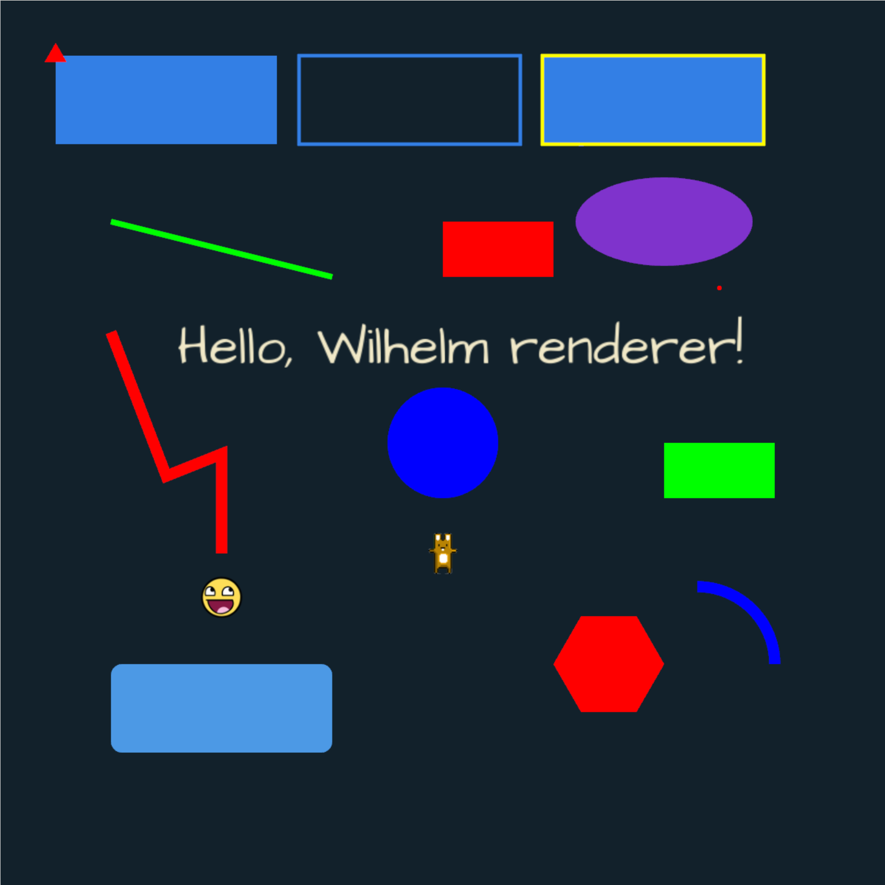

# wilhelm_renderer

wilhelm_renderer is a minimalist 2D graphics engine written in Rust with native OpenGL bindings. 
Its goal is to provide a robust foundation for rendering 2D shapes and visualizing 2-dimensional 
data in real time.

The current (0.4.0) release offers low-level OpenGL bindings and basic rendering capabilities. 
It is not yet production-ready. Future releases will expand the feature set with additional 
drawing primitives.

## ✨ Features

Currently supported drawing primitives:

- Points
- Lines (with antialiasing and thickness)
- Polylines
- Arcs
- Rectangles
- Triangles
- Circles
- Polygons
- Images

Other features:
- Bundled GLFW 3.4 (no external dependency required)
- Basic animation support
- Basic zoom in/out support
- Experimental svg output support

## 🚧 Status

⚠️ *APIs are still evolving --  always use the latest release*.

### 📦 Examples code

You can find usage examples in the [examples directory](https://github.com/algonents/wilhelm-renderer/tree/master/examples) 
of the **wilhelm_renderer** repository. These will be updated as new futures are introduced.

Basic API usage is illustrated below:

```rust
extern crate wilhelm_renderer;

use wilhelm_renderer::core::{App, Color, Renderable, Renderer, Window};
use wilhelm_renderer::graphics2d::shapes::Rectangle;
use wilhelm_renderer::graphics2d::shapes::ShapeRenderable;

fn main() {
    let window = Window::new("Shapes", 800, 800);
    let mut app = App::new(window);

    let mut shapes = vec![
        ShapeRenderable::line(
            100.0,
            200.0,
            300.0,
            250.0,
            Color::from_rgb(0.0, 1.0, 0.0),
            1.0,
        ),
        ShapeRenderable::polyline(
            &[
                (100.0, 300.0),
                (150.0, 430.0),
                (200.0, 410.0),
                (200.0, 500.0),
            ],
            Color::from_rgb(1.0, 0.0, 0.0),
            10.0,
        )
    ];

    let renderer = Renderer::new();
    renderer.set_point_size(6.0);

    app.on_render(move || {
        for shape in &mut shapes {
            shape.render(&renderer);
        }
    });
    app.run();
}
```
For a full example, see: 
- [shapes.rs](https://github.com/algonents/wilhelm-renderer/tree/master/examples/shapes.rs)



Additional examples:
- shapes_with_zoom.rs – illustrates zoom in/out functionality
- bouncing_balls – illustrates simple animation 
*(run with `cargo run` inside the `examples/bouncing_balls` folder)*

## 📖 Docs
tbd.
### Wiki

Refer to the **wilhelm_renderer** GitHub [wiki](https://github.com/algonents/wilhelm-renderer/wiki), which will be updated soon.


## 🐞 Issues

You can raise issues directly on [Github](https://github.com/algonents/wilhelm-renderer/issues).

## 🔧 Installation

### Linux

Make sure you have the necessary build tools installed (including a C/C++ compiler and CMake):

```shell script
sudo apt-get install libgl1-mesa-dev
sudo apt install mesa-utils
# libglfw3-dev is no longer required as of 0.4.0 (GLFW 3.4 is bundled)
# sudo apt install libglfw3-dev
sudo apt install libwayland-dev libxkbcommon-dev xorg-dev
```
You can add wilhelm_renderer as a dependency in your project. During the build process, 
Cargo will invoke CMake (using your system’s C/C++ compiler) to compile a static library 
containing the wilhelm_renderer FFI bindings to OpenGL

The FFI bindings are available in the 
project's [cpp/ directory](https://github.com/algonents/wilhelm-renderer/tree/master/cpp)


### Windows

Ensure you have Visual C++ Build Tools and CMake installed.

**For v0.4.0 and later**

No external GLFW installation is required — GLFW 3.4 is bundled and statically compiled with wilhelm_renderer. 
You only need a C/C++ compiler and CMake available in your environment.

**For versions prior to 0.4.0**
- Use release 0.1.7 or later (earlier versions did not support Windows)
- Install GLFW using [vcpkg](https://learn.microsoft.com/en-us/vcpkg/get_started/overview):

```shell script
git clone https://github.com/microsoft/vcpkg.git
cd vcpkg
.\bootstrap-vcpkg.bat
.\vcpkg install glfw3
```
Update your system's environment variables:

- Define the `VCPKG_LIB_PATH` environment variable to point to vcpkg's lib folder (where `glfw3.lib` is installed, 
e.g `D:\PATH_TO\vcpkg\installed\x64-windows\lib`)
- Add vcpkg's `bin` folder (where `glfw3.dll` is installed, e.g. `D:\PATH_TO\vcpkg\installed\x64-windows\bin`) to 
your system PATH.

### macOS
You need a C/C++ compiler and CMake available in your environment.

**For v0.4.0 and later**
No external GLFW installation is required — GLFW 3.4 is bundled and statically compiled with *wilhelm_renderer*.

**For versions prior to 0.4.0**

- Install GLFW using [Homebrew](https://brew.sh/):

```shell script
brew install glfw
brew info glfw
```

Once glfw is installed, the crate's build script will look for the glfw libraries under `/opt/homebrew/lib`

