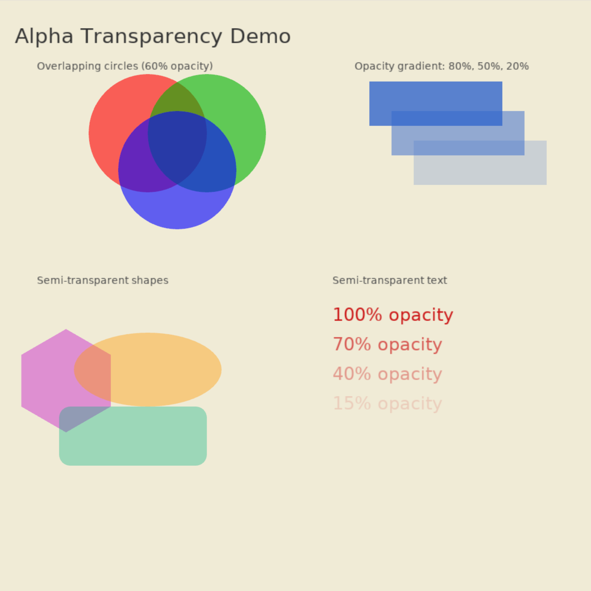

# Alpha Transparency

Demonstrates alpha/opacity support: overlapping semi-transparent circles, opacity gradients on rectangles, semi-transparent shapes, and text at varying opacity levels.



```shell
cd examples/alpha_transparency && cargo run
```
