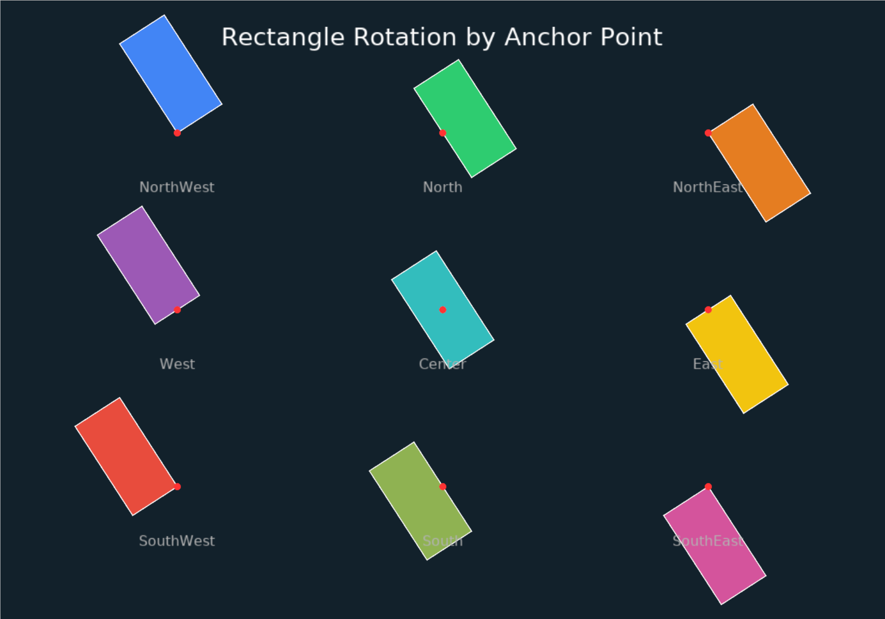

# Anchor Rotations

A 3x3 grid of rectangles each rotating around a different anchor point (NW, N, NE, W, Center, E, SW, S, SE). Red dots mark the pivot position and labels identify each anchor variant.



```shell
cd examples/anchor_rotations && cargo run
```
