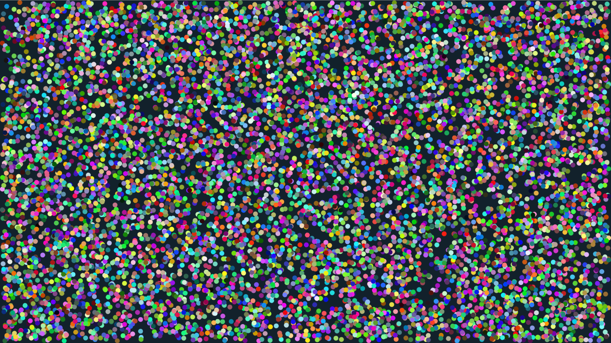

# Bouncing Balls (Instanced)

10,000 animated balls rendered with instanced rendering. All balls share a single VAO/VBO and are drawn in one instanced draw call with per-instance colors.



```shell
cd examples/bouncing_balls_instanced && cargo run
```
