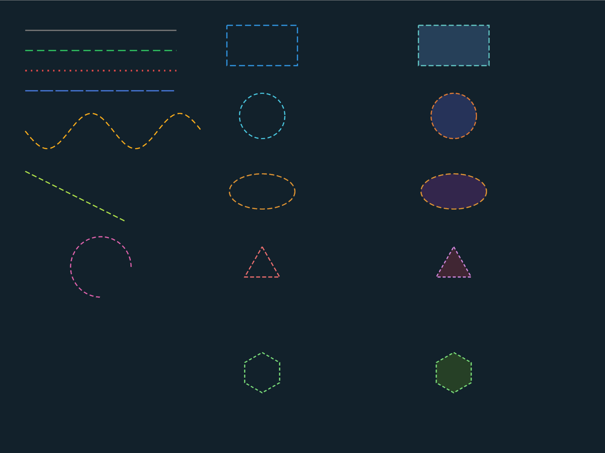

# Dashed Lines & Shapes

Demonstrates dashed/dotted rendering across all shape types. Three columns: dashed lines and polylines (left), stroke-only shapes (middle), fill+dashed stroke (right). Covers Line, Polyline, Arc, Rectangle, Circle, Ellipse, Triangle, and Polygon.



```shell
cd examples/dashed_lines && cargo run
```
