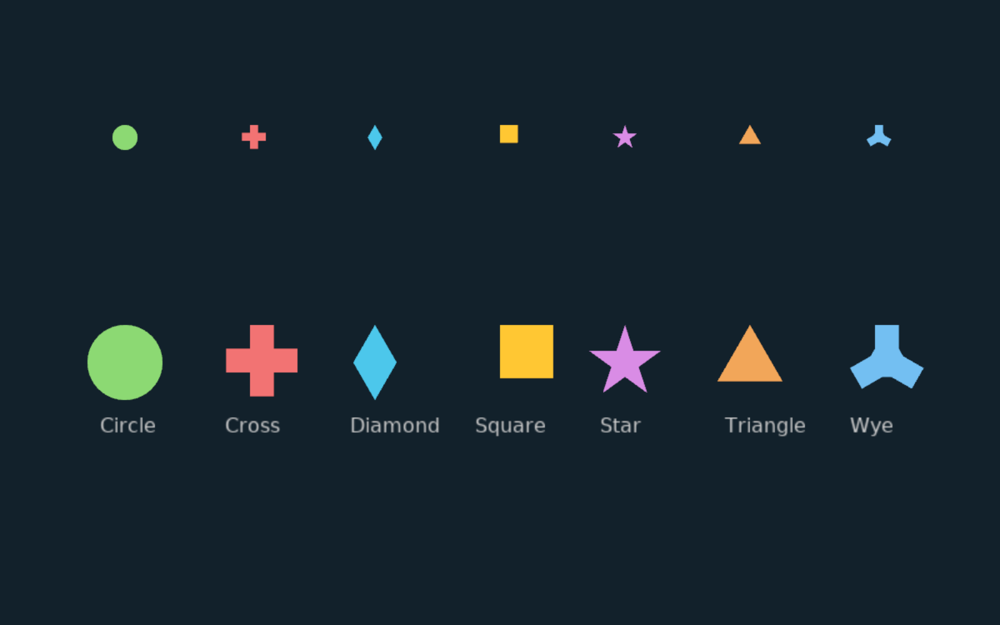

# Markers

All seven `MarkerType` variants (Circle, Cross, Diamond, Square, Star, Triangle, Wye) rendered at two sizes with labels. Markers generate polygon vertices via `MarkerType::vertices(radius)`.



```shell
cd examples/markers && cargo run
```
