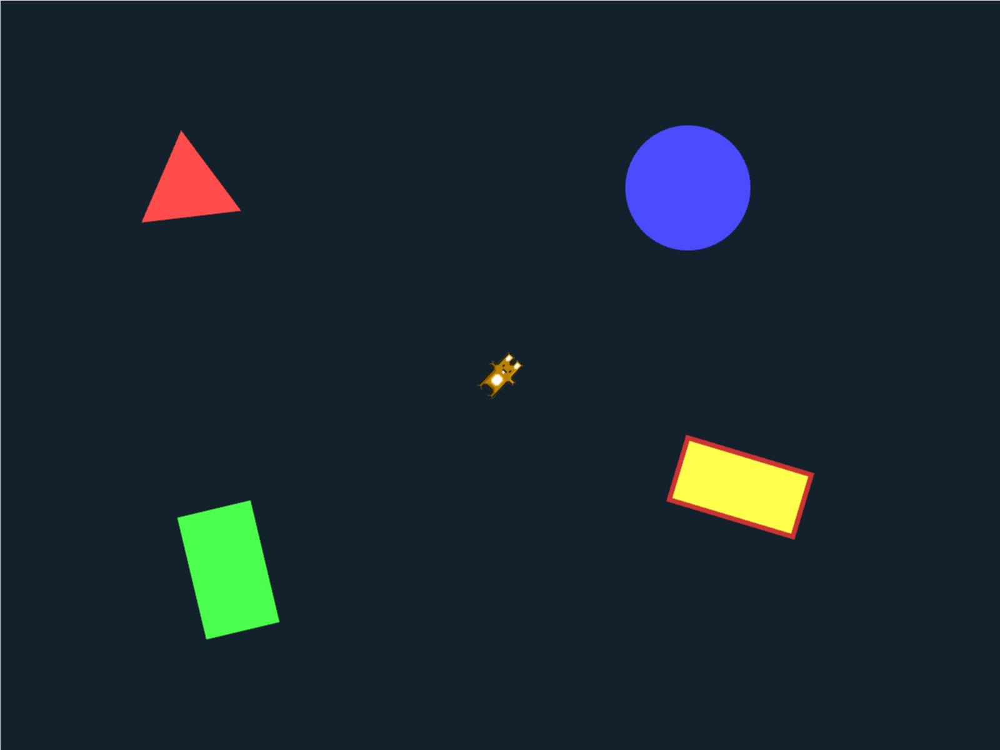

# Rotations

Per-shape rotation and animation. A triangle, rectangle, circle, fill+stroke rectangle, and image all rotate at different speeds with varying scale.



```shell
cd examples/rotations && cargo run
```
