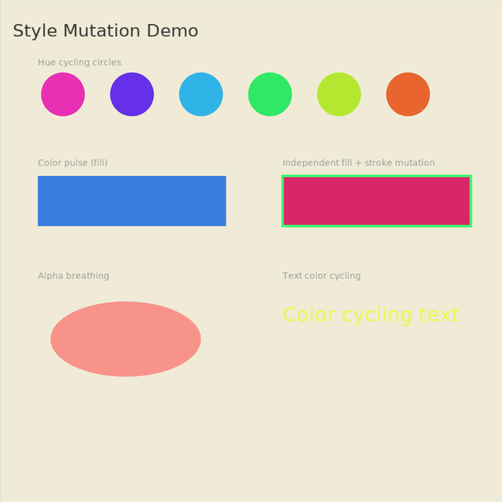

# Style Mutation

Dynamic color changes without rebuilding shapes. Demonstrates `set_fill_color()`, `set_stroke_color()`, and `Color::from_hsl()` with hue cycling circles, color pulsing, independent fill/stroke mutation, alpha breathing, and text color cycling.



```shell
cd examples/style_mutation && cargo run
```
