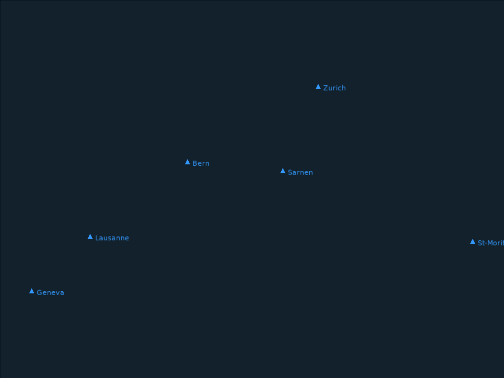

# Waypoints

WGS84 coordinates projected to screen via Mercator and Camera2D. Swiss cities are rendered as triangle markers with text labels. Supports scroll-to-zoom and mouse drag to pan.



```shell
cd examples/waypoints && cargo run
```
