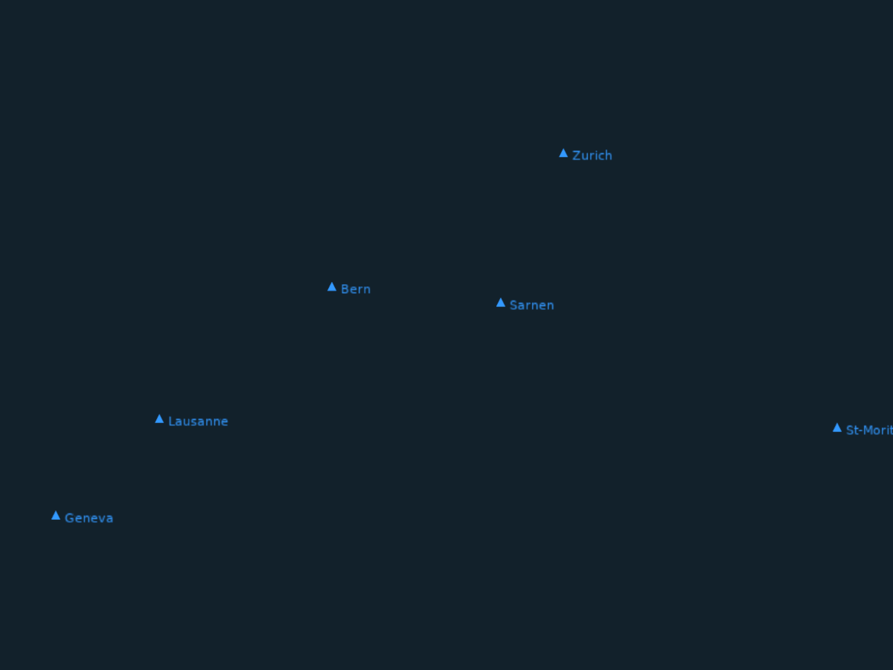

# Waypoints (Instanced)

Same as the waypoints example but with instanced markers. All triangle markers share a single VAO and are rendered in one instanced draw call. Labels remain individual shapes.



```shell
cd examples/waypoints_instanced && cargo run
```
